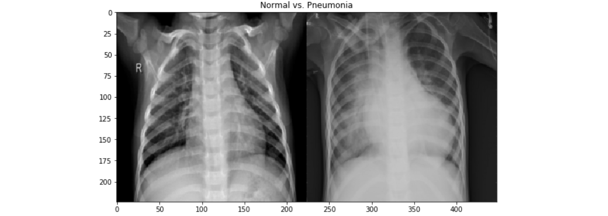
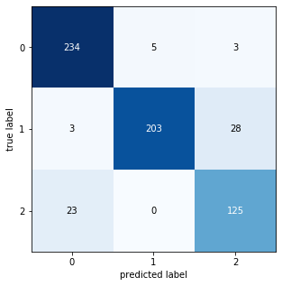
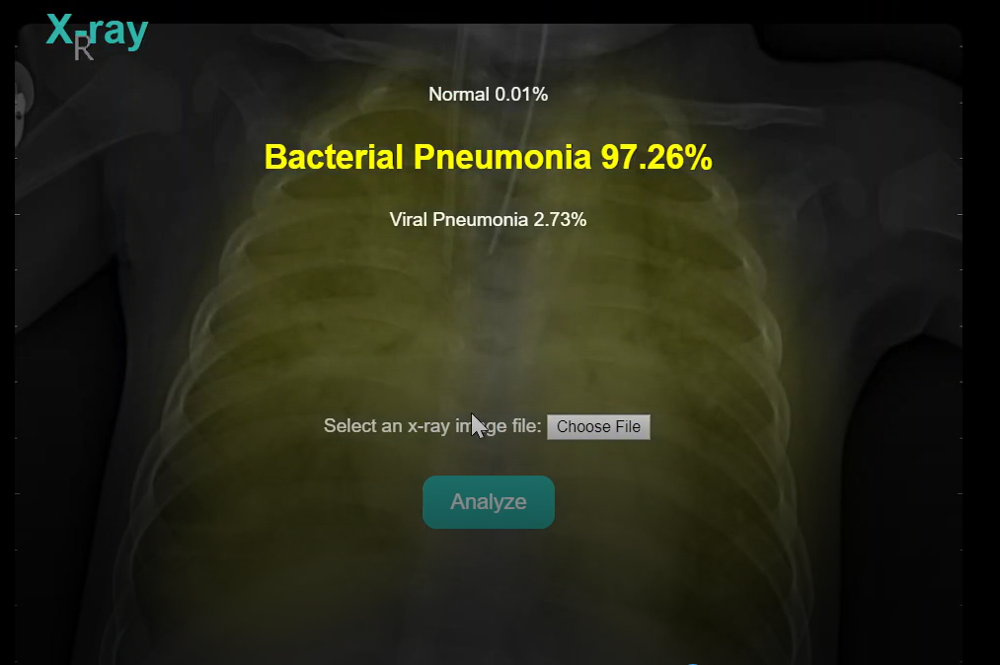

# DSI-CC9 Capstone Project

# Identifying Pneumonia by Chest X-Ray Images

## ***Repository Contents***

- code  
    - 1_Data_Collection_EDA  
    - 2_Data_Preprosessing_Simple_CNN  
    - 3_Model_VGG16_Arthitecture  
    - 4_Model_Complex_CNN  
    - 5_Model_Interpretation  
- data  
- flask  
- media  
- Technical_Report.ipnyb  
- Capstone_Presentation.pdf  

## ***Table of Contents***

- [Heading](#1. Executive Summary)
- [Heading](#2. Data)
- [Heading](#3. Model Performance)
- [Heading](#4. Web Application)
- [Heading](#5. Next Steps)

## ***1. Executive Summary***

Pneumonia is an inflammatory condition of the lung affecting primarily the small air sacs known as alveoli. Typically symptoms include some combination of productive or dry cough, chest pain, fever, and trouble breathing. Severity is variable.

Pneumonia is usually caused by infection with viruses or bacteria and less commonly by other microorganisms, certain medications and conditions such as autoimmune diseases. Diagnosis is often based on the symptoms and physical examination. Chest X-ray, blood tests, and culture of the sputum may help confirm the diagnosis. The disease may be classified by where it was acquired with community, hospital, or health care associated pneumonia.

The goal of this project is constructing a convolutional neural network (CNN) to identify whether a patient has pneumonia or not by classifying their chest X-ray images. This project is adequately scoped and focuses on one specific type of disease rather than targeting multiple diagnosis. Creating a robust algorithm that provides fast and accurate diagnosis is beneficial for both patients and medical proffesionals.

## ***2. Data***

Source: https://data.mendeley.com/datasets/rscbjbr9sj/2  
Published: 6 Jan 2018 | Version 2 | DOI: 10.17632/rscbjbr9sj.2  
Contributor(s): Daniel Kermany, Kang Zhang, Michael Goldbaum  

The data used was collected from Mendeley public datasets repository and described as Labeled Optical Coherence Tomography (OCT) and Chest X-Ray Images for Classification. Chest X-ray images were selected from retrospective cohorts of pediatric patients of one to five years old from Women and Children’s Medical Center, Guangzhou. The dataset consists of 5,863 X-Ray images (JPEG) and 2 categories: Pneumonia/Normal. Pneumonia images are annotated as Bacterial or Viral in file names that were later separated to build a multiclass classification network.  
Approximately 10% of the images from each category were moved to test folder to be used in validation of the model.

## ***3. Model Performance***

- Train Accuracy: 84%  
- Validation Accuracy: 86%  
- Precision: 72%  
- Recall 98%  

## ***4. Web Application***

A web application was built where user uploads a chest x-ray image and immediately receives the probability rates of 3 distinct diagnoses:   
1- Normal  
2- Bacterial Pneumonia  
3- Viral Pneumonia  

## ***5. Next Steps***

- Collecting more data.  
- Adding more complexity in model and using gridsearch functionality.  
- Creating additional model with PyTorch library and compare the results.  
- Researching on how to detect most informative pixels on X-ray (highest weights) and highlight them on image output.  
- Having radiologists interpret same X-rays and compare their performance with model’s performance.
